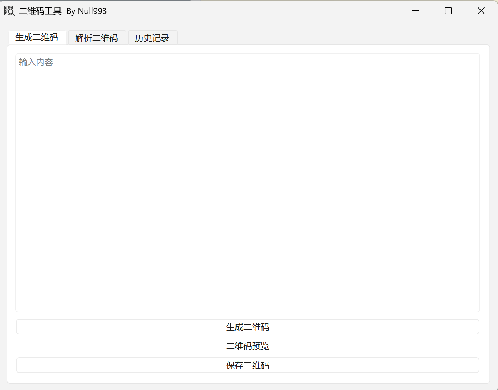
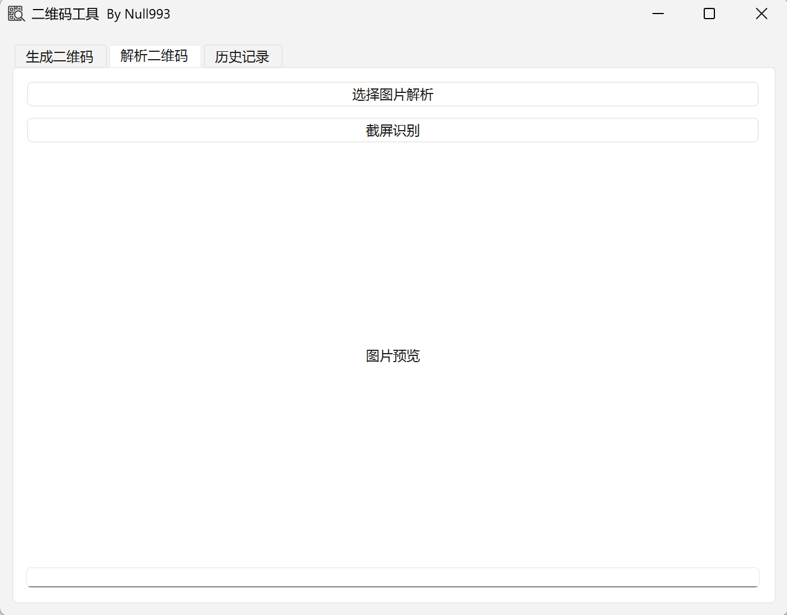
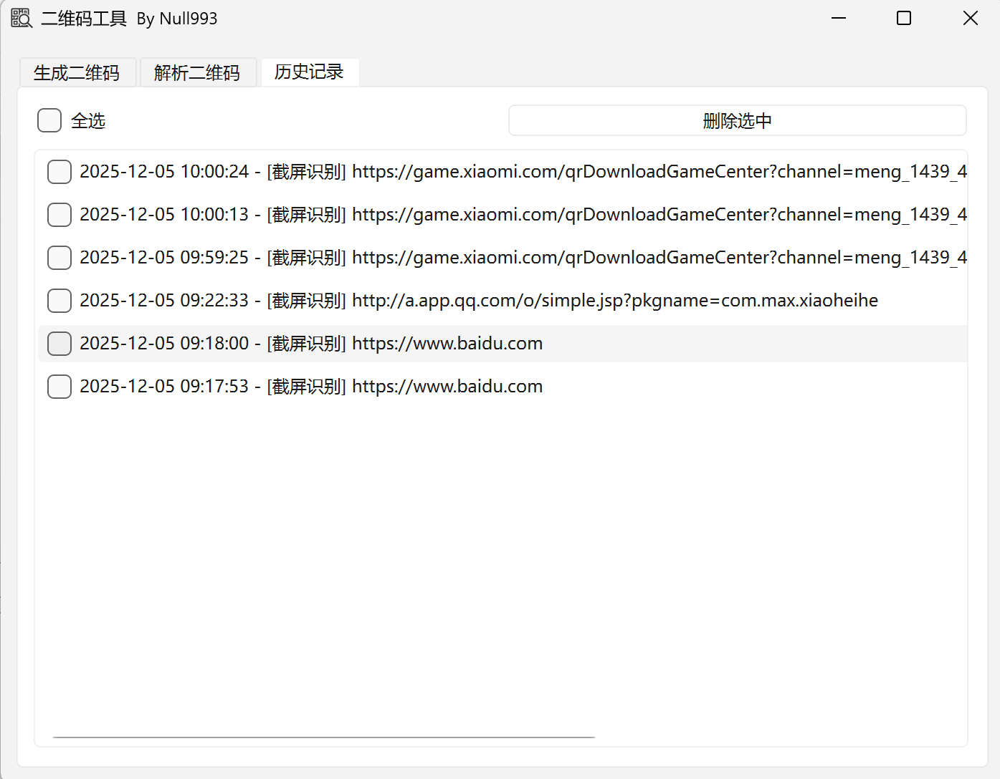

# 二维码工具

本工具是一个集 **二维码生成、解析、截屏识别、历史记录管理** 于一体的桌面应用，采用 **PySide6** 开发 UI，支持系统托盘后台运行。

---

## 🧩 功能特性

### ✔ 1. 生成二维码  
- 输入任意文本即可生成二维码  
- 支持保存为 PNG 图片  
- 自动记录生成历史  



### ✔ 2. 解析二维码  
- 选择本地图片解析  
- 支持 PNG / JPG / JPEG  
- 自动检测是否为 URL（可点击打开）  
- 自动记录解析历史  

### ✔ 3. 截屏识别二维码  
- 截图框选区域自动识别二维码  
- 兼容高 DPI 屏幕  
- 自动记录截屏识别历史  


### ✔ 4. 历史记录系统  
- 新格式记录：记录来源/内容/时间  
- 支持批量选择与删除  
- 支持右键复制内容  
- 双击自动打开识别出的 URL  



### ✔ 5. 系统托盘支持  
- 可隐藏到托盘后台运行  
- 托盘右键：
  - 显示主界面  
  - 截屏识别  
  - 退出  
- 兼容 Windows 某些系统右键不显示菜单的问题  

---

## 🛠 运行环境要求

### Python 版本  
```
Python 3.9+
```

### 安装依赖  
运行：
```
pip install -r requirements.txt
```

---

## 🚀 启动程序  
```
python main.py
```

---

## 📁 项目结构（示例）

```
项目目录
├── main.py          # 主程序
├── icon.png         # 图标文件（可自行替换）
├── history.json     # 历史记录（自动生成）
├── requirements.txt
└── README.md
```

---

## 💡 注意事项  
- 若使用高 DPI 屏幕，可自动适配  
- 若托盘图标不显示，请确保 `icon.png` 存在  
- 若识别二维码失败，请确认截图或图片是否清晰  

---

## 📜 License  
本项目采用 Creative Commons Attribution-NonCommercial 4.0 International (CC BY-NC 4.0) 许可证发布。

