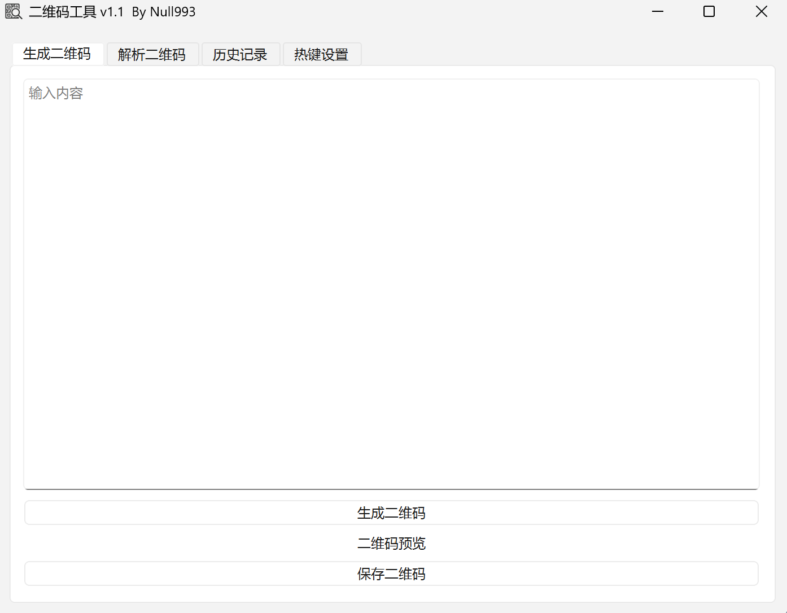
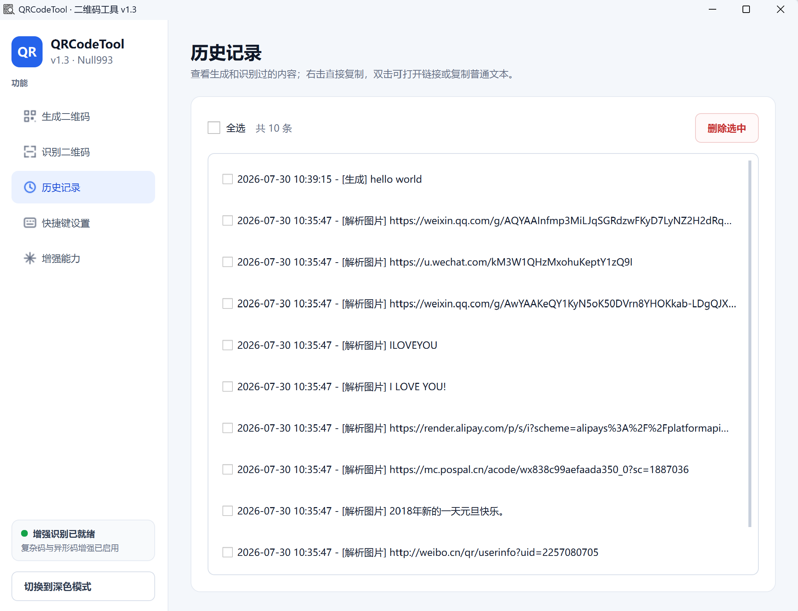
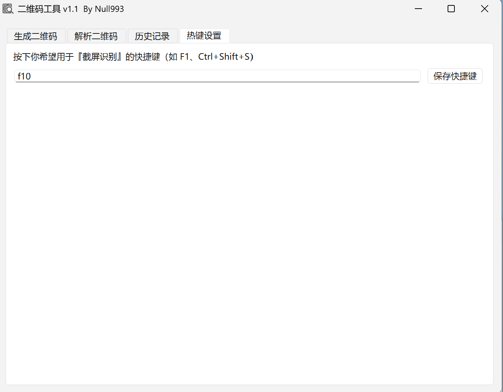

# 二维码工具

本工具是一个集 **二维码生成、解析、截屏识别、历史记录管理** 于一体的桌面应用，采用 **PySide6** 开发 UI，支持系统托盘后台运行。

---

## 🧩 功能特性

### ✔ 1. 生成二维码  
- 输入任意文本即可生成二维码  
- 支持保存为 PNG 图片  
- 自动记录生成历史  



### ✔ 2. 解析二维码  
- 选择本地图片解析  
- 支持 PNG / JPG / JPEG  
- 基础版自动组合 ZXing 和 ZBar，无需安装大型图像或深度学习运行库
- 快速识别失败后，使用 Qt 原生低对比度、自适应阈值、颜色通道、静区补白和小尺寸增强
- 可导入 QReader/PyTorch 增强包，提升复杂、破损和带 Logo 二维码识别能力
- 完整增强包会同时启用 OpenCV、NumPy、CLAHE 和模型识别
- 增强包在独立模型线程中加载和预热，不阻塞基础识别
- 自动检测是否为 URL（可点击打开）  
- 自动记录解析历史  

### ✔ 3. 截屏识别二维码  
- 截图框选区域自动识别二维码  
- 兼容高 DPI 和多显示器，保留原始物理像素清晰度
- 识别在后台线程执行，不阻塞主界面
- 自动记录截屏识别历史  

自动识别可以处理部分低清、倾斜、反色、带 Logo 等异形二维码。


### ✔ 4. 历史记录系统  
- 新格式记录：记录来源/内容/时间  
- 支持批量选择与删除  
- 支持右键复制内容  
- 双击自动打开识别出的 URL  



### ✔ 5. 自定义快捷键 
- 可以通过组合快捷键或者单个热键一键使用截屏识别



### ✔ 6. 系统托盘支持
- 可隐藏到托盘后台运行  
- 托盘右键：
  - 显示主界面  
  - 截屏识别
  - 退出

### ✔ 7. 可选增强包
- 基础程序不再内置 QReader、PyTorch 和模型，体积与启动负担更低
- 在“增强包”页签中导入 ZIP，无需修改程序安装目录
- 默认安装到程序所在目录的 `active` 子目录，也可以在界面中自定义并保存路径
- 用绿勾/红叉逐项显示清单、兼容性、QReader、PyTorch、模型等状态
- 支持无增强包、部分增强包和完整增强包；组件缺失不会影响基础识别
- 导入后显示文件数量、解压体积、兼容性、缺失组件和运行时验证结果

增强包格式及构建方法见 [增强包开发说明](docs/enhancement-package.md)。

---

## 🛠 运行环境要求

### Python 版本  
```
Python 3.10+
```

### 安装依赖  
运行：
```
pip install -r requirements.txt
```

---

## 🚀 启动程序  
```
python main.py
```

---

## 📁 项目结构（示例）

```
项目目录
├── main.py                   # 轻量启动入口
├── qrcap/
│   ├── app.py                # 主窗口与业务交互
│   ├── capture.py            # 多显示器截图
│   ├── recognition.py        # 基础/增强识别流水线
│   ├── enhancement.py        # 增强包导入、分析与激活
│   └── resources.py          # 资源和用户数据路径
├── tools/
│   └── build_enhancement_pack.py
├── tests/
├── icon.ico
├── history.json     # 历史记录（自动生成）
├── config.json      # 配置文件（自动生成）
├── requirements.txt
└── README.md
```

---

## 💡 注意事项  
- 若使用高 DPI 屏幕，可自动适配  
- 若托盘图标不显示，请确保 `icon.ico` 存在
- 若识别二维码失败，请确认截图或图片是否清晰
- 未安装增强包时，ZXing 和 ZBar 基础识别仍可正常使用

---

## 📜 License  
本项目采用 Creative Commons Attribution-NonCommercial 4.0 International (CC BY-NC 4.0) 许可证发布。
